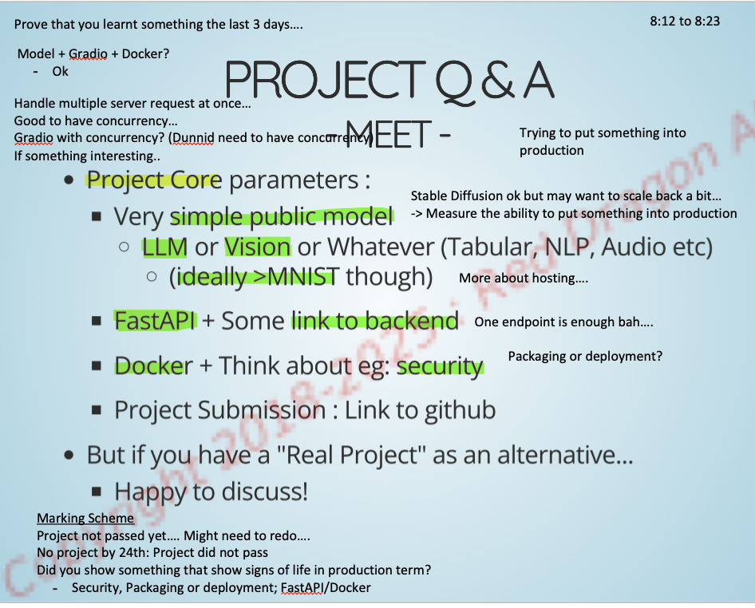

# goh_jia_jun_RDAI

2.  Docker Compose the application
   - Run `docker compose up --build` 

NOTE: /app_base dunnid

TODO: 
1) gitignore certain modules (DONE)
2) Make virtual environment (DONE)
3) Make basic FASTAPI with heartbeat (without docker first) (DONE)
4) Install gradio with basic endpoint (DONE)
5) Check if can call FASTAPI with gradio (DONE)
6) Call gradio with the current implementation (Change to Streamlit)
7) Remove the confidential document
8) Add LLM (just use ollama) - dont use the confidential document
9) Alter slightly, I am using Tabular data
10) Alter Docker Compose... dunnid Postgres and Redis
11) Probably need to check security or something....
12) Alter Nginx and UI need to alter slighlty 